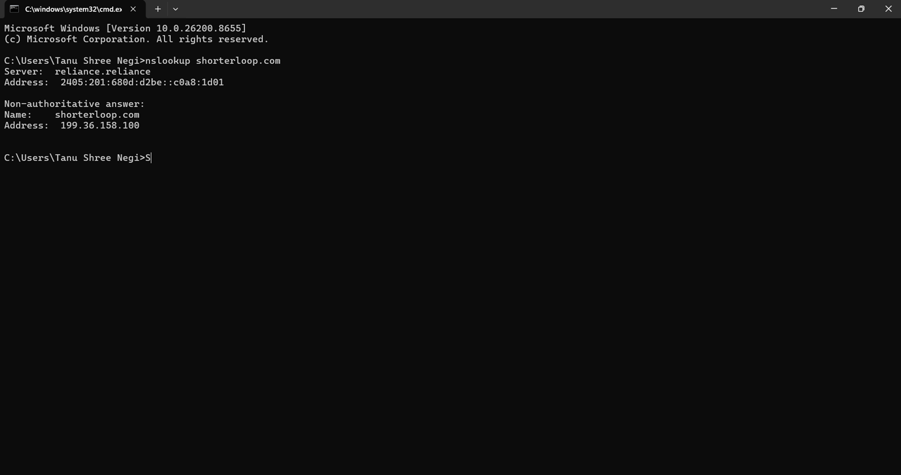
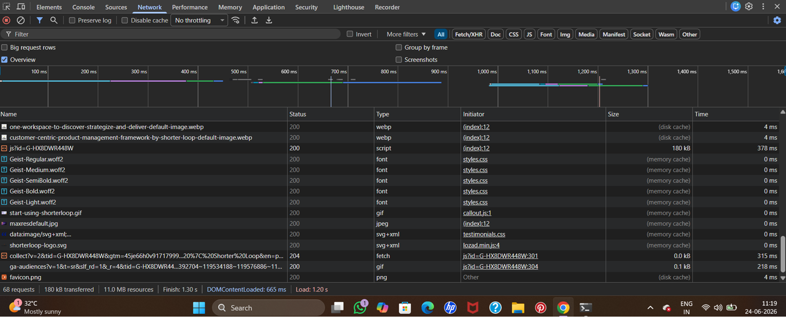

# http-under-the-hood

## What Happens When You Type a URL and Press Enter?

Most people think a website loads instantly.
In reality, a series of precise technical steps happen 
in milliseconds. Here is the full journey of how 
`shorterloop.com` loads in the browser.

---

## Step 1: DNS Resolution
The browser first checks its local cache to see if it 
already knows the IP address of shorterloop.com.
If not, it sends a query to a DNS (Domain Name System) 
resolver, which looks up the domain and returns the 
corresponding IP address.

Result:
shorterloop.com → 199.36.158.100

This is like looking up a contact name in your phone 
to get the actual phone number.

---

## Step 2: TCP Connection + TLS Handshake
Using the IP address, the browser initiates a TCP 
(Transmission Control Protocol) connection with the 
server at 199.36.158.100 on port 443 (HTTPS).

A TLS (Transport Layer Security) handshake then occurs,
where the browser and server:
- Agree on an encryption method
- Verify the server's SSL certificate
- Establish a secure, encrypted channel

All data exchanged after this point is encrypted.

---

## Step 3: HTTP Request
The browser sends an HTTP GET request to the server:

GET / HTTP/1.1
Host: shorterloop.com
Accept: text/html
Connection: keep-alive

---

## Step 4: HTTP Response
The server processes the request and responds with 
a status code and the requested resource.

Common status codes:
- 200 OK → Resource found and delivered
- 304 Not Modified → Use the cached version
- 404 Not Found → Resource does not exist

In our case, shorterloop.com returned 304,
meaning the browser already had a cached copy
and the server confirmed nothing had changed.

---

## Step 5: Browser Rendering
The browser receives the HTML and begins rendering:

1. Parses HTML → builds the DOM tree
2. Finds linked CSS files → sends GET requests
3. Finds JavaScript files → sends GET requests
4. Finds images and fonts → sends GET requests
5. Applies CSS styles to the DOM
6. Executes JavaScript
7. Paints the final page on screen

Total requests observed: 67
Total load time: 685ms

---

## Network Requests Observed - shorterloop.com

GET / → 304
Type: document (HTML)
Header: content-type: text/html

GET /lozad.min.js → 200 OK
Type: script
Header: content-type: application/javascript

GET /fonts.css → 200 OK
Type: stylesheet
Header: content-type: text/css

GET /main.css → 200 OK
Type: stylesheet
Header: content-type: text/css

GET /styles.css → 200 OK
Type: stylesheet
Header: content-type: text/css

---

## DNS Lookup Output

Command: nslookup shorterloop.com

Server:  reliance.reliance
Address: 2405:201:680d:d2be::c0a8:1d01

Non-authoritative answer:
Name:    shorterloop.com
Address: 199.36.158.100
